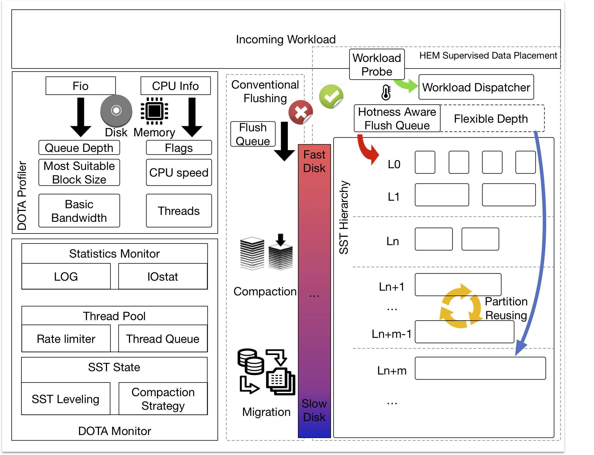
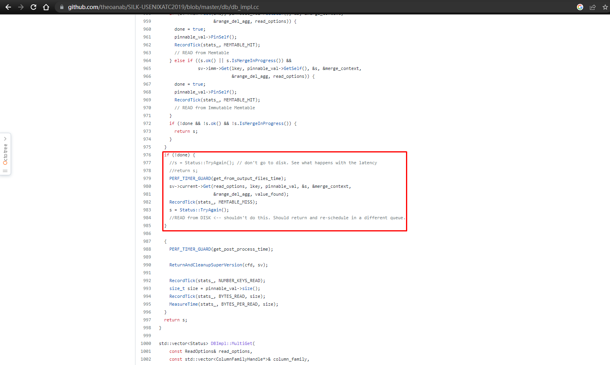
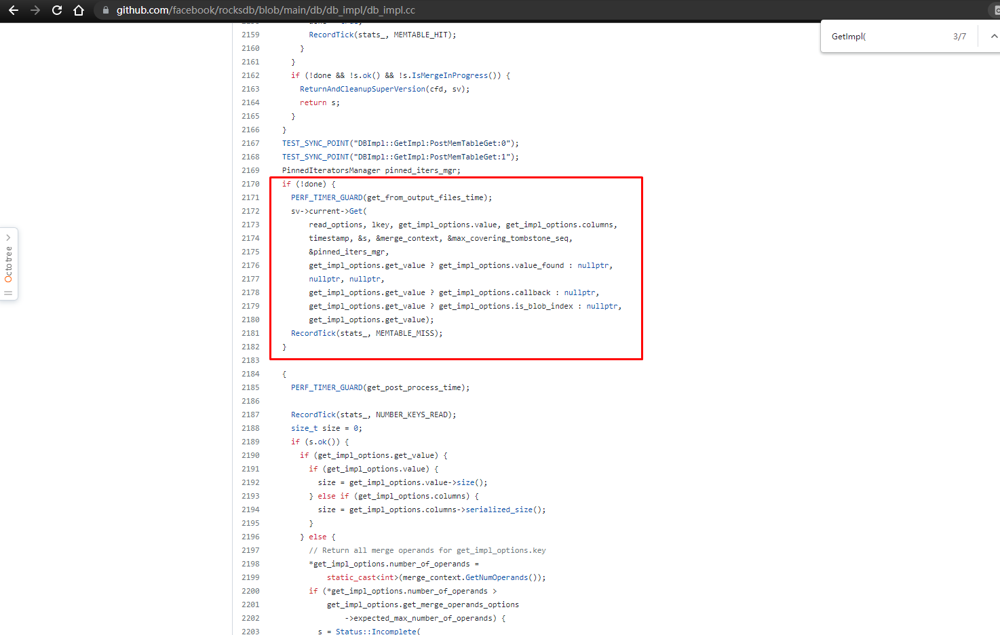

# ADOC: Automatic Data Overflow Control

> This is the implementation of the [paper](https://www.usenix.org/conference/fast23/presentation/yu) published on the conference FAST'23.

## Mofications:

Here are the modified files:

1. YCSB workload generator
    - ycsbcore/*
2. Extended reporter agent
    - include\rocksdb\utilities\DOTA_tuner.h
    - include\rocksdb\utilities\report_agent.h
    - utilities\DOTA\DOTA_tuner.cc
    - utilities\DOTA\report_agent.cc
3. Option files to configure the ADOC tuner
    - options.h
4. Metrics collection in files:
    - This is actually part of the featrue to quantalize the flow and predict the overflowing (**work in progress**)

## How to use?

For now, you can only use it inside db_bench_tool.cc, but we will publish a black box version later. 

But don't worry, you can always transplant it, since the tuner logic is simple enough, and has been implemented inside the reporter agent, which is a benchmark counter. 

### To compile 

Thanks for the feedback from [Yemaoxin](23020221154137@stu.xmu.edu.cn).

I have not updated the CMakeList yet, please compile it with `make` command in the home directory:

`make db_bench -j4`

### To Enable

Also thanks for the feedback from [Yemaoxin](23020221154137@stu.xmu.edu.cn).

You can find the `FEA_enable`, `TEA_enable` in the start up parameters.

- To run ADOC-T, use `--TEA_enable=true, --FEA_enable=false`
- To run ADOC-B, use `--TEA_enable=false, --FEA_enable=true`
- To run ADOC, use `--TEA_enable=true, --FEA_enable=true`

### Evaluation tool

You can look at this [repo](https://github.com/supermt/ADOC-Rocks-tracker.git), which is a RocksDB evaluation tool used in this paper.

**Differences betwen the advisor script in tools/advisor**

*+* ADOC is an online tuning framework, while the advisor is an offline tuning framework, which gives the tuning operation based on the execution LOG of _db_bench_.

*+* ADOC collects data directly from the DB pointer, while the advisor reads the occurrence from the LOG. 

## What's next?

### Make it a black box

> We are going to provide the ADOC as a black box, all you need to do is to enable it in the db_option

> We are also going to implement it outside rocksdb, in this case, you only need a DB pointer to perform online tuning

### Predict and pre-tuning based on quantitative 

This is actually a work-in-progress, offline training can be very expensive, but the AIMD method is event-driven, it could be a more economic way to do that, and great thanks to the questioner **Chun Liu** from FutureWei. 
s

### DOTA Project

DOTA: Device-oriented Tuning Advisor

This can be a project help deploying LSM-KV into production environments, especially the heterogeneous environments. ADOC is the one that performs tuning operations on the thread pool. (Batch size tuning is used to balance the effect of thread tuning, we've explained that in the end of Evaluation section.)

If you are interested in, we are always looking for collaborations.

> BUT I'm not sure when can I start the next round of developement. Since it's not part of my thesis, but still, I will try to make some progress on it.

### **About SILK**

The SILK implementation in this repo is a placeholder, since we failed to reproduce the read performance as mentioned in its paper. Please download it from the [original github repo](https://github.com/theoanab/SILK-USENIXATC2019)

You may find the GET() operation in SILK is super fast.
> In the original design, it suppose further search through deeper levels, while SILK directly return a `retry` status. 

> GetImpl() in SILK

> GetImpl() in RocksDB

